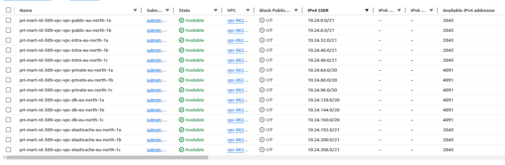
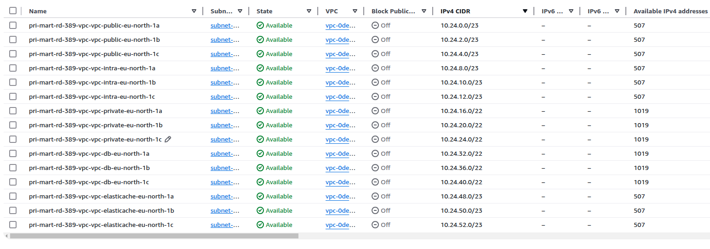
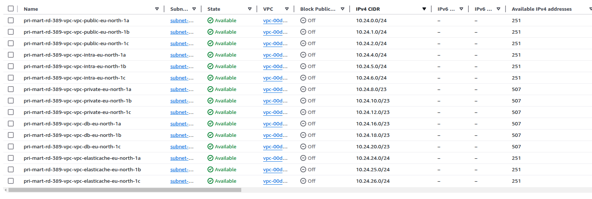
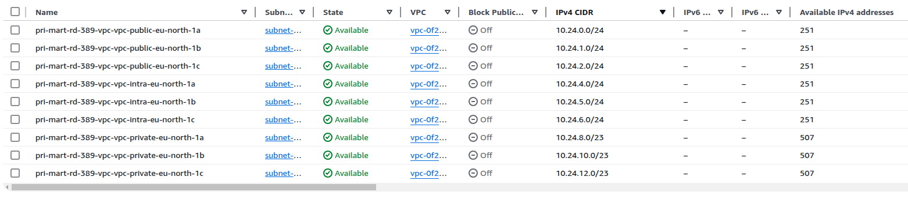
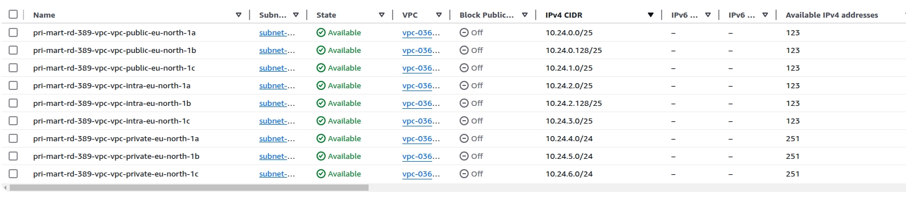
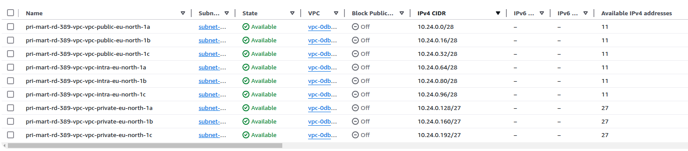
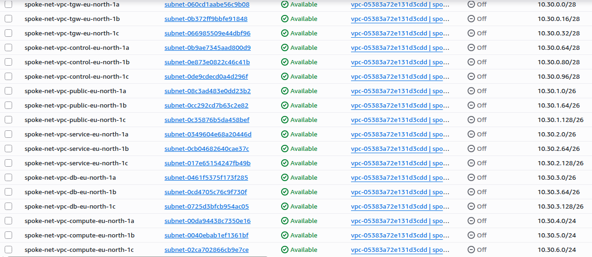

## Oppinionated module for vpc creation ##


Oppinionated version of this https://registry.terraform.io/modules/terraform-aws-modules/vpc/aws/latest


### Automatic subnet calculations ###
If you do not specify the subnet ranges and only the vpc_cidr, then the module will create the subnets automatically. When the range is smaller than 19 (/21, /22 ...) then the database and elasticache subnets are not created.

In addition we support two subnet calculation modes (subnet_split_mode = "default" and "spoke)". The latter will create separated subnets for control plane, loadbalancers and servers/compute.

We do leave a lot of spare space when using (azs = 2). This is done to enable clients to later switch to a 3 zone setup without recreating subnets. It will also keep NACL rules simple - by allowing one range to cover the same type subnets.

If the automatic calculation is not to Your liking then specify each subnet as desired.


### subnet_split_mode = default
#### vpc_cidr: "10.24.0.0/16"


#### vpc_cidr: "10.24.0.0/18"


#### vpc_cidr: "10.24.0.0/19"


#### vpc_cidr: "10.24.0.0/20"


#### vpc_cidr: "10.24.0.0/21"


#### vpc_cidr: "10.24.0.0/24"


### subnet_split_mode = spoke
#### vpc_cidr: "10.30.0.0/21"


### Example code ###
```
    modules:
      - name: vpc
        source: aws/vpc
        inputs:
          vpc_cidr: "10.24.0.0/20"
          one_nat_gateway_per_az = false #Will only create 1 nat gw, not two
          azs = 2
```
Will result in networks:
__public ( 10.24.0.0/22 for NACL )__

public-a ( 10.24.0.0/24 )

public-b ( 10.24.1.0/24 )

__intra ( 10.24.4.0/22 for NACL )__

intra-a ( 10.24.4.0/24 )

intra-b ( 10.24.5.0/24 )


__private ( 10.24.8.0/21 for NACL )__

private-a ( 10.24.8.0/23 )

private-b ( 10.24.10.0/23 )

__No database networks are created.__

__No elasticsearch networks are created.__


```
    modules:
      - name: vpc
        source: aws/vpc
        inputs:
          vpc_cidr: "10.24.0.0/20"
          one_nat_gateway_per_az = true #Will create three nat gw-s into each public subnet
          azs = 3
          intra_subnets: |
            ["10.24.4.0/23", "10.24.6.0/23"]
          database_subnets: |
            ["10.24.14.0/24", "10.24.15.0/24"]

```
Will result in networks:
__public ( 10.24.0.0/22 for NACL )__

public-a ( 10.24.0.0/24 )

public-b ( 10.24.1.0/24 )

public-c ( 10.24.3.0/24 )

__intra ( 10.24.4.0/22 for NACL )__

intra-a ( 10.24.4.0/23 )

intra-b ( 10.24.6.0/23 )


__private ( 10.24.8.0/21 for NACL )__

private-a ( 10.24.8.0/23 )

private-b ( 10.24.10.0/23 )

private-c ( 10.24.10.0/23 )

__database ( 10.24.14.0/23 for NACL )__

db-a 10.24.14.0/24

db-b 10.24.15.0/24

__No elasticsearch networks are created.__

### IPv6 support scenarios ###

**Scenario 1 — Inbound IPv6 from external clients (most common)**
External IPv6 clients connect to a dual-stack ALB/NLB. The load balancer accepts the IPv6 connection and forwards it to backend pods/services over IPv4. The EKS cluster and internal services do not need to be IPv6-aware — IPv6 terminates at the load balancer edge. `enable_ipv6 = true` is sufficient. DNS64 is not needed and should remain disabled.

**Scenario 2 — IPv4-mode EKS pods connecting to IPv4-only internal services**
IPv4-mode EKS pods only have IPv4 addresses. When DNS64 is disabled (the default), internal services that are not dual-stack like MSK return only A records, pods connect over IPv4, and everything works without any special configuration.

**Scenario 3 — IPv4-mode EKS pods connecting to dual-stack internal services, or DNS64 is enabled**
When a service has AAAA records (dual-stack) or DNS64 is enabled (synthesizing `64:ff9b::` AAAA records for IPv4-only hostnames), IPv4-mode EKS pods will see both A and AAAA records for internal services. Since the pod has no IPv6 address it cannot complete an IPv6 connection. What happens next depends on the client:

- **Clients with proper fallback** — attempt IPv6, receive an immediate "network unreachable", retry over IPv4 transparently. No visible impact.
- **Clients with poor fallback** — ends on the IPv6 error instead of falling back, causing connection failures.

If you hit this with a specific client, either disable DNS64 (`subnet_enable_dns64 = false`, the default) or configure the client to prefer IPv4.

**DNS64 + NAT64 (`subnet_enable_dns64`, default: `false`)**
DNS64 is only beneficial for genuinely IPv6-capable clients (e.g. EC2 instances with IPv6 addresses, or a dual-stack EKS cluster) that need to reach IPv4-only destinations. AWS NAT Gateway supports NAT64 natively — when `subnet_enable_dns64 = true` and a NAT Gateway is present, this module automatically creates a `64:ff9b::/96` route via the NAT Gateway to handle the translation. IPv4-mode EKS pods have no IPv6 source address and cannot use this path.
